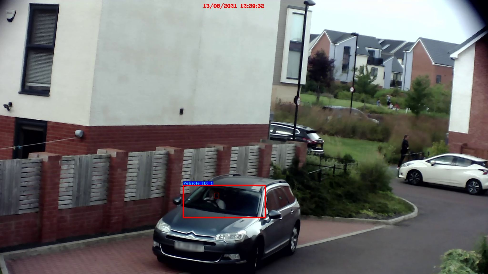

# Identification of Driver Phone Usage Violations using YOLOv4, YOLOv3 and DeepSort.

In this work, we propose a fully-automated system that will take live video feed from roadside surveillance cameras and detect if a driver is using a mobile phone whilst the vehicle is in operation. Different quality cameras (high-end, low-end) have been used for the study, whilst addressing challenges such as windscreen glare, tinted windows and low-light scenarios. The system is fully automated, it will take a screenshot of the violations, log each unique violation, and count vehicles. This information will be fully accessable via a Power BI dashboard.

## Two different approaches:
1. One-step: Single model that detects both licence plate and phone usage.
2. Two-step: Two models running simultaneously. First model to detect windscreen. Second model to use cropped image to find the phone villation.

DeepSort used to keep count of nuymber of phone violations and vehicles.


## Hardware/Software
- NVIDIA RTX 2080
- AMD Ryzen 3800X

- Python 3.8
- CUDA 10.1
- cuDNN 7
- Tensorflow 2.2.0
- Numpy 1.18.5
- Pandas 1.2.3
- Opencv 4.5.1

## Download YOLOv3/v4 weights
yolov3
wget -P model_data https://pjreddie.com/media/files/yolov3.weights

yolov4
wget -P model_data https://github.com/AlexeyAB/darknet/releases/download/darknet_yolo_v3_optimal/yolov4.weights

File structure should be arranged like this:
```bash
└───Directory
    ├───archived scripts
    ├───checkpoints
    ├───deep_sort
    │   └───__pycache__
    ├───detections

    ├───IMAGES
    │   ├───for the report
    │   ├───frames_to_test
    │   ├───vid_to_test
    │   └───vid_to_train
    ├───log
    ├───mAP
    │   └───ground-truth
    ├───mAP-master
    │   ├───input
    │   │   ├───detection-results
    │   │   │   └───archive
    │   │   ├───ground-truth
    │   │   │   ├───archive
    │   │   │   └───backup
    │   │   └───images-optional
    │   ├───output
    │   │   ├───classes
    │   │   └───images
    │   │       └───detections_one_by_one
    │   └───scripts
    │       └───extra
    ├───model_data
    │   └───coco
    ├───OIDv4_ToolKit-master
    │   ├───modules
    │   │   └───__pycache__
    │   └───OID
    │       ├───csv_folder
    │       └───Dataset
    │           ├───test
    │           │   ├───Phone
    │           │   └───Vehicle_registration_plate
    │           └───train
    │               ├───Phone
    │               │   └───Label
    │               └───Vehicle_registration_plate
    │                   └───Label
    ├───tools
    ├───yolov3
```

## Prepare images
- For Google Open Images - see OIDv4 ToolKit 
- 'old_to_pascal.py' to convert old Pascal to XML 
- For bespoke images - Manually annotate using **Labelimg** 
- Run 'XML_to_YOLOv3' to convert XML to Yolov3 format 

Once XML files have been created run **XML_to_YOLOv3.py** in tools directory


## Train model
- Set ANNOT paths in config.py in YOLOv3 directory 
- Train model using **train.py** 
- tensorboard --logdir=log 
- Track training progress in Tensorboard and go to http://localhost:6006\:


## AP and mAP
- Test images saved in mAP-master/input/images-optional 
- Annotations (Pascal format) saved in mAP-master/input/ground-truth (file names to be same name as image / file) 
- Run 'get_detection_results.py' to create detections files 
- Select IOU threshold in **main.py** - default set to 0.5
- Set CWD to ./mAP-master and run **main.py**

## Set up config file
### When running two step:
- TRAIN_MODEL_NAME is set to windscreen detector and TRAIN_MODEL_NAME2 is set to phone detector
- YOLO_INPUT_SIZE and YOLO_INPUT_SIZE2 should be set accordingly
- Ensure class_names.txt class set to **Vehicle ID:** amd class_names2.txt set to **Phone** located in **/model_data** director

### For single step
- Set TRAIN_MODEL_NAME and YOLO_INPUT_SIZE required
- Ensure class_names.txt lists Phone and PLate classes

## Run model with object tracking
- For one_step - run **tracker_one_step.py**
- For two_step - run **tracker_two_step.py**

When ran for the first time the script will create a a new directory - **detections** as well as a subdirectory with today's date to store images, and **summary** subdirectory to store and update the CSV file.
To automatically take and save snapshots of the detections, set **take_snapshot** argument to True



## References
- Cloned and modified from https://github.com/pythonlessons/TensorFlow-2.x-YOLOv3 
- For downloading stock images from Google Image Dataset - https://github.com/EscVM/OIDv4_ToolKit.git 
- For mAP - https://github.com/Cartucho/mAP